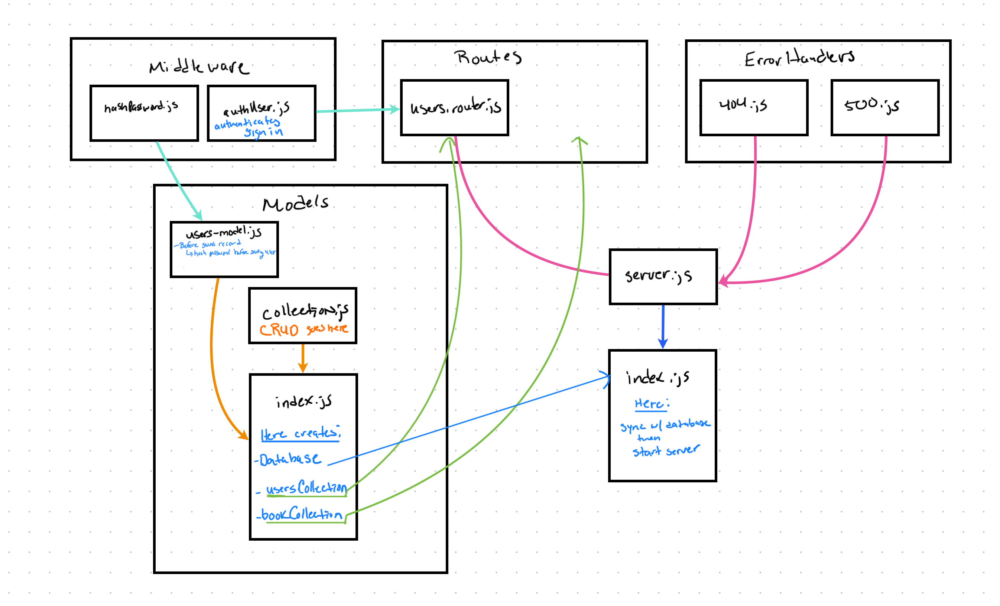

# LAB - Class 06

## Project: Authentication

### Author: Melo

### Problem Domain

**Authentication System Phase 1:**  

Deploy an Express server that implements Basic Authentication, with signup and signin capabilities, using a Postgres database for storage.

### Links and Resources

- [Pull Request](https://github.com/MelodicXP/api-server/pull/6)
- [GitHub Actions ci/cd](https://github.com/MelodicXP/basic-auth/actions)
- Prod [back-end server url](https://four01lab03-api-server-prod.onrender.com)

### Collaborators

### Setup

#### `.env` requirements (where applicable)

DATABASE_URL: postgres://localhost:XXXX/name-of-server

#### How to initialize/run your application (where applicable)

- e.g. `npm start`

#### How to use your library (where applicable)

#### Features / Routes

- Feature One: Deploy as prod branch once all tests pass.

#### Tests

- How do you run tests?
  - jest and supertest

- Any tests of note?
  - 404 on a bad route
  - 404 on a bad method
  - POST to /signup to create a new user.
  - POST to /signin to login as a user (use basic auth).
  - Tests for auth middleware and routes.

#### UML

